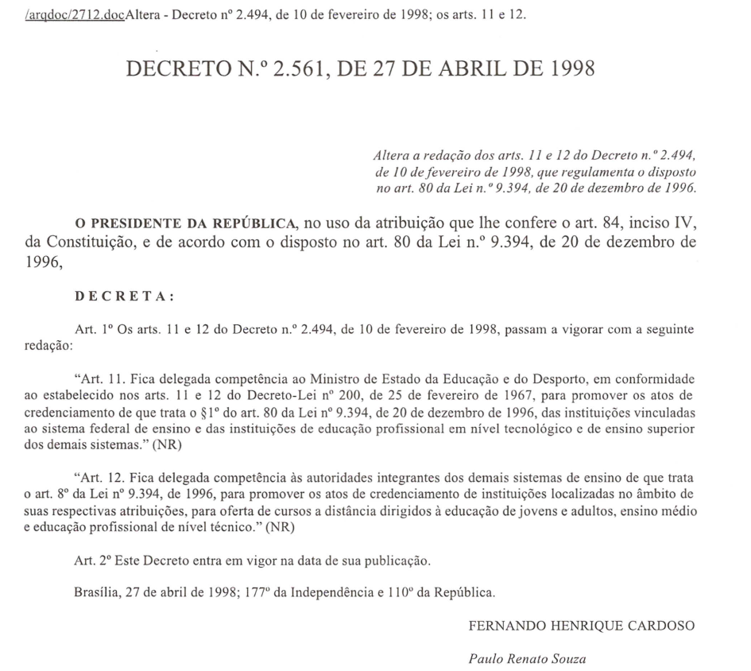
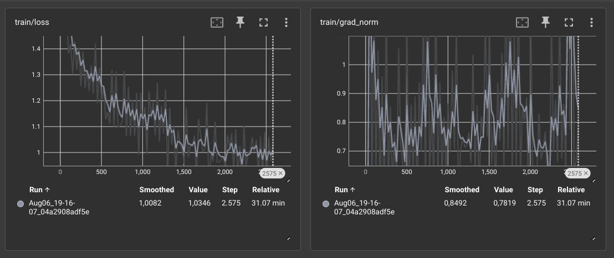

# NLP - Turma 2024/1
## Trabalho final sobre Fine-tuning de instruções de LLM

Aluno: `Junio Freitas`
Data: `05-08-2024`

---

### Conteúdo deste relatório

- download_pdfs.py: script python para baixar os pdf do site da legislação acadêmica
- pdf2textbr.py: script python que extrai o texto de um arquivo pdf, inclusive faz OCR para extrair texto de imagens do pdf
- extract_text_pdf.py: script python que extrai os textos dos pdfs baixados usando o pdf2textbr.py
- process_data.py: script python que realiza o pré-processamento dos textos extraídos dos pdfs
- construct_instruction_dataset.py: script python que constrói o dataset de instruções para o fine-tuning do LLM
- pdfs: pasta com os pdfs baixados
- result-pdfs: pasta com os textos extraídos dos pdfs
- text-preprocess: pasta com os textos pré-processados
- text-merge: pasta com o arquivo merge_data.txt que contém todos os textos pré-processados em um único arquivo
- dataset-instructions: pasta com o dataset de instruções para o fine-tuning do LLM


### Resumo

Neste relatório, será apresentado o trabalho final da disciplina de Processamento de Linguagem Natural (NLP) - LLM, do curso de Pós-graduação em Informática da Universidade Federal do Amazonas (UFAM). O objetivo deste trabalho é realizar o fine-tuning de um modelo de linguagem de grande porte (LLM) para a geração de instruções sobre a legislação acadêmica de graduação da UFAM. Para isso, foram implementados um conjunto de passos que vão desde o download dos arquivos pdf da legislação acadêmica, passando pelo pré processamento dos textos extraídos dos pdfs, até a construção do dataset de instruções para o fine-tuning do LLM. AO final, um LLM foi treinado com o dataset de instruções para que consiga responder perguntas sobre a legislação acadêmica de graduação da UFAM, com ou sem o uso da técnica RAG.

A seguir será explicado cada um dos passos implementados para a realização deste trabalho.

### Download dos pdfs

O primeiro passo para a realização deste trabalho foi o download dos arquivos pdf da legislação acadêmica de graduação da UFAM. Para isso, foi implementado o script python download_pdfs.py, que realiza o download dos pdfs do site da legislação acadêmica da UFAM. Os pdfs baixados foram salvos na pasta pdfs.

O link para o site da legislação acadêmica da UFAM é: [Legislação Acadêmica UFAM](https://proeg.ufam.edu.br/legislacao-academica)

Foram baixados um total de 57 arquivos pdf da legislação acadêmica de graduação da UFAM. Dentre alguns desses arquivos pdf, os textos estavam em formato de imagem, o que dificultou a extração do texto. Para contornar esse problema, foi implementado o script python pdf2textbr.py, que extrai o texto de um arquivo pdf, inclusive faz OCR para extrair texto de imagens do pdf, que será explicado a seguir.

### Extração de texto dos pdfs

O segundo passo para a realização deste trabalho foi a extração do texto dos arquivos pdf baixados. Para isso, foi implementado o script python extract_text_pdf.py, que extrai os textos dos pdfs baixados usando o pdf2textbr.py. Os textos extraídos dos pdfs foram salvos na pasta result-pdfs. 

O script pdf2textbr.py é capaz de extrair textos de imagens contidas nos pdf com alta precisão, pois utiliza a biblioteca Tesseract, neste caso, utilizou a base treinada para textos em português. Para melhorar o processo de extração, este script utiliza também técnicas de Visão Computacional, para melhoria da imagem antes de extrair o texto em si.

Como exemplo, é mostrado abaixo um trecho de um arquivo pdf salvo como imagem e o texto extraído do pdf.

   

Texto extraído do pdf:
```
largdoc/2712.docAltera - Decreto nº 2.494, de 10 de fevereiro de 1998; os arts. 11 e 12.

DECRETO N.º 2.561, DE 27 DE ABRIL DE 1998

Altera a redação dos arts. 11 e 12 do Decreto n.º 2.494,
de 10 de fevereiro de 1998, que regulamenta o disposto
no art. 80 da Lei n.º 9.394, de 20 de dezembro de 1996.

O PRESIDENTE DA REPÚBLICA, no uso da atribuição que lhe confere o art. 84, inciso IV,
da Constituição, e de acordo com o disposto no art. 80 da Lei n.º 9.394, de 20 de dezembro de

1996,
DECRETA:

Art. 1º Os arts. 11 e 12 do Decreto n.º 2.494, de 10 de fevereiro de 1998, passam a vigorar com a seguinte
redação:

“Art. 11. Fica delegada competência ao Ministro de Estado da Educação e do Desporto, em conformidade
ao estabelecido nos arts. 11 e 12 do Decreto-Lei nº 200, de 25 de fevereiro de 1967, para promover os atos de
credenciamento de que trata o $1º do art. 80 da Lei nº 9.394, de 20 de dezembro de 1996, das instituições vinculadas
ao sistema federal de ensino e das instituições de educação profissional em nível tecnológico e de ensino superior
dos demais sistemas.” (NR)

“Art. 12. Fica delegada competência às autoridades integrantes dos demais sistemas de ensino de que trata
o art. 8º da Lei nº 9.394, de 1996, para promover os atos de credenciamento de instituições localizadas no âmbito de
Suas respectivas atribuições, para oferta de cursos a distância dirigidos à educação de jovens e adultos, ensino médio
e educação profissional de nível técnico.” (NR)
Art. 2º Este Decreto entra em vigor na data de sua publicação.
Brasília, 27 de abril de 1998; 177º da Independência e 110º da República.
FERNANDO HENRIQUE CARDOSO

Paulo Renato Souza
```


### Pré-processamento dos textos extraídos

O terceiro passo para a realização deste trabalho foi o pré-processamento dos textos extraídos dos pdfs. Para isso, foi implementado o script python process_data.py, que realiza o pré-processamento dos textos extraídos dos pdfs. Os textos pré-processados foram salvos na pasta text-preprocess.

O pré-processamento dos textos consistiu nas seguintes etapas:
- Remoção de caracteres estranhos
- Remoção de números isolados e uma linha
- Ajuste de parágrafos quebrados
- Remoção de espaços em branco extras
- Remoção de linhas em branco

O maior desafio nesta etapa foi ajustar os parágrafos, pois muitos textos extraídos dos pdfs estavam quebrados em várias linhas, o que dificultava a leitura e o entendimento do texto. Para contornar esse problema, foi implementado um algoritmo que identifica e ajusta os parágrafos quebrados.

Foi decidido que o texto extraído dos pdfs seria mantido em formato de texto simples, sem a necessidade de realizar a tokenização, pois o LLM é capaz de lidar com textos em formato de texto simples.

### Geração do dataset de instruções

O quarto passo para a realização deste trabalho foi a construção do dataset de instruções para o fine-tuning do LLM. Para isso, foi implementado o script python construct_instruction_dataset.py, que constrói o dataset de instruções para o fine-tuning do LLM. O dataset de instruções foi salvo na pasta dataset-instructions.

Para construção desse dataset, foram realizados os seguintes passos:
- Divisão dos textos de cada pdf em tamanho fixo de 2048 caracteres
- Foi enviado para o LLM (gpt-3.5-turbo) o prompt: 
```
### Instruções: Baseado no arquivo {focus} com informações sobre a legislação acadêmica de Graduação da Universidade Federal do
            Amazonas (UFAM) abaixo, gere {num_inst} pares de respostas detalhadas com instruções.
            Certifique-se de que a instrução-resposta esteja no formato json:\n\n
            ### Exemplo: {{"Instruction": "a instrução", "Response": "a resposta"}}\n\n
            ### Descrição:{describe}\n\n
            ### Resposta:
```
onde {focus} é o nome do arquivo pdf, {num_inst} é o número de instruções a serem geradas multiplicado por 25, e {describe} é o bloco de texto de cada arquivo.
- Quando todos os blocos de um arquivos são enviados aoa LLM, repete-se o processo para o próximo arquivo.
- Ao final o resultado é salvo em um arquivo json. 

Ao total foram geradas 7493 instruções com respostas detalhadas com instruções sobre a legislação acadêmica de graduação da UFAM.

Exemplos de instruções geradas:
```
Instruction: Qual é o objetivo da Carta de Serviços ao Usuário?
Response: O objetivo da Carta de Serviços ao Usuário é informar sobre os serviços relacionados aos trâmites administrativos para processos acadêmicos.

Instruction: Qual é o Departamento que disponibiliza os dados e informações sobre a Universidade Federal do Amazonas (UFAM)?
Response: O Departamento de Registro Acadêmico (DRA) é responsável por disponibilizar dados e informações sobre a UFAM, como matrículas e registros acadêmicos dos alunos.

Instruction: Qual é o horário de funcionamento da Proeg?
Response: A Proeg funciona de segunda a sexta-feira, das 8h às 12h e das 13h às 17h.

```

### Treinamento do LLM

O quinto passo para a realização deste trabalho foi o treinamento do LLM com o dataset de instruções gerado, conforme passo anterior. A implementação dessa etapa foi realizada no Google Colab, baseada no código fornecido pelo professor da disciplina. Todos os detalhes de como foi feito o treinamento do LLM estão disponíveis no notebook [fine_tuning_instructions_jusf.ipynb]([fine_tuning_LLM.ipynb](https://colab.research.google.com/drive/12SzVlFDMoXudh10r3AlhGkwjkAMv39OF#scrollTo=PW88AtmWNi0R)). Como modelo de LLM foi utilizado uma versão não oficial do Llama, a Llama-2-7b-chat-hf. Como técnica de Low-rank Adaptation (LoRA) foi utilizada a biblioteca BitsAndBytes que foi responsável por diminuir o tamanho do modelo para 3588Mb. Foi utilizado o método de tokenização padrão do modelo. O treinamento foi realizado por 1 época, com batch size de 42e learning rate de 2e-4.

A duração do treinamento foi de aproximadamente 31 minutos. Segue abaixo o gráfico que mostra as métricas de avaliação e desempenho do modelo durante o treinamento.



Exemplode de resposta do modelo treinado:
```
Pergunta: Quais são os documentos para o aluno realizar a matrícula?

Resposta: A resposta é que a matrícula deverá ser realizada por meio do Sistema Integrado de Ensino - SIE, que é o sistema utilizado pela Universidade Federal do Amazonas (UFAM) para a matrícula de seus alunos. Além disso, é importante lembrar que a matrícula pode ser realizada apenas no período definido pela CEG, que é o órgão responsável pela matrícula. Para acessar o SIE, é necessário estar ciente das informações e prazos estabelecidos pela CEG. Além disso, é importante lembrar que o aluno deve ter o pré-requisito para a disciplina e o número máximo de créditos permitidos por período deve ser cumprido.
```

#### Implementação do modelo RAG

Para a implementação do modelo RAG, foi gerado um único arquivo texto contendo o textos extraídos dos pdfs, que foi salvo na pasta text-merge. Depois essa base foi indexada, primeiramente, quebrando o texto em chunks de tamanho padrão, depois foi gerada uma base de documentos vetoriais crfiados usando o método _bge-small-en-v1.5_. Abaixo é mostrado um exemplo de uma consulta por similaridade de documentos sobre essa base vetorial.

```python
docs = vectorstore.similarity_search("matrícula")
print(docs[0].page_content)
```

A resposta foi:
```
1º. Os pedidos de correção de matrícula que apresentarem documento comprovando a impossibilidade de acesso ao Portal do Aluno nos três períodos definidos para solicitação de matrícula, serão analisados em caráter excepcional pela CEG.
2º. Os pedidos de correção que se configurarem matrícula em disciplinas/turmas com carga horária prática, sem disponibilidade de vagas, deverão vir acompanhados dos documentos especificados nos incisos I, II e III deste artigo e da autorização do aumento de vagas assinada pelo chefe de departamento/coordenador acadêmico responsável pela disciplina.
Artigo 15. As solicitações serão avaliadas pela Câmara de Ensino de Graduação que, após análise, emitirá parecer conclusivo sobre cada solicitação.
Paragrafo único. As solicitações deferidas pela Câmara de Ensino de Graduação, em reunião com data fixada no Calendário Acadêmico, serão registradas pela PROEG diretamente no Sistema Integrado de Ensino.
Artigo 16. Em período também estabelecido no Calendário Acadêmico, a PROEG emitirá diários de classe definitivos.
Artigo 17. São considerados erros institucionais:
I. Matrícula em disciplina/turma rejeitada por falta de pré-requisito, tendo o aluno cursado com aproveitamento o pré-requisito, e este não foi lançado no histórico escolar do aluno;
II. Matrícula em disciplina/turma rejeitada por exceder o número máximo de créditos por período, estando o aluno na condição descrita no parágrafo único do Artigo 11 desta resolução.
III. Matrícula em disciplina/turma rejeitada por conflito de horário, sendo este resultado de oferta errada no Sistema feita pela Coordenação de Curso.
Poder Executivo Ministério da Educação Universidade Federal do Amazonas Conselho de Ensino, Pesquisa e Extensão - CONSEPE Câmara de Ensino de Graduação - CEG RESOLUÇÃ0 019/2012-CEG/CONSEPE DE 27 ABR DE 2012 9
Artigo 18. No período destinado à correção de matrícula junto à CEG a PROEG/DOA aceitará pedido de matrícula em disciplina de estágio, monografia ou trabalho de conclusão de curso que tenha restrição quanto ao número de alunos por orientador desde que essa restrição tenha sido informada à PROEG antes do período da PRIMEIRA SOLICITAÇÃO.
Artigo 19. Fica terminantemente proibido qualquer procedimento no Sistema Integrado de Ensino - SIE, no período destinado à correção de matrícula pela CEG que não esteja previsto na presente Resolução, principalmente os que se configurem troca de turma ou de disciplina, nova matrícula ou cancelamento de disciplina.
Artigo 20. Revogam-se as disposições em contrário, especialmente a Resolução n. 008/2011  CEG/CONSEPE de 14 de março de 2011.
PLENÁRIO MOYSÉS ABRAHAM COHEN/UFAM, em Manaus, 27 de abril de 2012.
Rosana Cristina Pereira Parente Presidente
```

Por fim, foram feitas consultas ao modelo treinado com as instruções geradas junto com RAG. Abaixo é mostrado um exemplo de uma consulta ao modelo treinado com a técnica RAG.

```
Pergunta: Quais são os documentos para o aluno realizar a matrícula?

Resposta: A resposta é que a matrícula deverá ser realizada por meio do Sistema Integrado de Ensino - SIE, que é o sistema utilizado pela Universidade Federal do Amazonas (UFAM) para a matrícula de seus alunos. Além disso, é importante lembrar que a matrícula pode ser realizada apenas no período definido pela CEG, que é o órgão responsável pela matrícula. Para acessar o SIE, é necessário estar ciente das informações e prazos estabelecidos pela CEG. Além disso, é importante lembrar que o aluno deve ter o pré-requisito para a disciplina e o número máximo de créditos permitidos por período deve ser cumprido.
```

O modelo foi salvo e está disponível no HuggingFace (https://huggingface.co/juniofreitas/llm_legislacao_ufam)  para ser utilizado para responder perguntas sobre a legislação acadêmica de graduação da UFAM.


### Conclusão

Neste relatório, foi apresentado o trabalho final da disciplina de Processamento de Linguagem Natural (NLP) - LLM, do curso de Pós-graduação em Informática da Universidade Federal do Amazonas (UFAM). O objetivo deste trabalho foi realizar o fine-tuning de um modelo de linguagem de grande porte (LLM) para a geração de instruções sobre a legislação acadêmica de graduação da UFAM. Para isso, foram implementados um conjunto de passos que vão desde o download dos arquivos pdf da legislação acadêmica, passando pelo pré processamento dos textos extraídos dos pdfs, até a construção do dataset de instruções para o fine-tuning do LLM. Ao final, um LLM foi treinado com o dataset de instruções para que consiga responder perguntas sobre a legislação acadêmica de graduação da UFAM, com ou sem o uso da técnica RAG. Foram obtidos resultados satisfatórios, com um modelo treinado capaz de responder perguntas sobre a legislação acadêmica de graduação da UFAM com uma boa precisão.

### Referências

- [Legislação Acadêmica UFAM](https://proeg.ufam.edu.br/legislacao-academica)
- Aulas do professor André Carvalho

